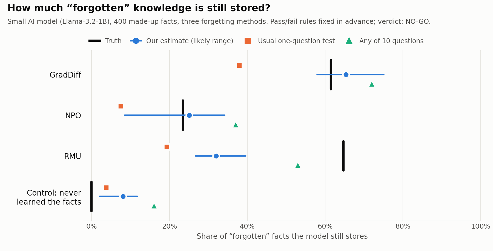

# Is It Really Forgotten? Occupancy Models for Auditing LLM Unlearning

**Can a method from wildlife counting tell us how much an AI model still remembers after it was told to forget? We tested it carefully. It partly works, and partly fails — this repository shares both.**

Parit Kansal · October 2026 · [paritkansal.in](https://paritkansal.in) · [OpenReview](https://openreview.net/profile?id=~Parit_Kansal1) · [GitHub](https://github.com/ParitKansal)

<picture>
  <source media="(prefers-color-scheme: dark)" srcset="figures/results-dark.png">
  
</picture>

*How to read the chart: the **black bar** is the truth. The **blue dot** is our estimate, with its likely range. The **orange square** is what the usual test reports. The closer a mark is to the black bar, the better.*

## In short
- **The problem.** Companies can make an AI model "forget" things, such as private data or dangerous knowledge. To check that it worked, they usually ask the model **one question per fact**. If it answers wrongly, the fact is called "forgotten".
- **Why that can mislead.** A model may still **know** the fact but not say it to that one question. Asked in another way, the fact comes back.
- **The idea.** Ecologists face the same problem with animals: not seeing a bird on one visit does not mean the bird is gone. They visit many times and use a statistical tool, the **occupancy model**, to estimate how many birds are really there. We treat each fact like a forest, and each way of asking a question like a visit.
- **What we found.**
  - ✅ The usual one-question test **underestimates** what the model still knows by **1.6 to 3.4 times**.
  - ✅ For two unlearning methods (GradDiff, NPO), our estimate was **within 4 percentage points of the truth**.
  - ❌ On a model that **never learned** the facts, our method still claimed 8% were known. Some answers are easy to guess, and the method mistook lucky guesses for memory.
  - ❌ One method (RMU) hides knowledge so well that **no question reveals it**, yet a little retraining brings 65% back. Asking questions alone cannot measure that.
- **Verdict.** We wrote our pass/fail rules **before** running anything. By those rules the method **failed** (NO-GO). We publish it anyway, because the lessons are useful.

## The idea in one table
| Counting birds | Checking an AI model |
|---|---|
| a forest | one fact the model was told to forget |
| the bird lives there | the model still stores the fact |
| one visit to the forest | one way of asking (direct question, reworded question, multiple choice, fill-in-the-blank, asking 16 times, ...) |
| share of forests with the bird | share of "forgotten" facts the model still stores |
| chance one visit spots the bird | chance one way of asking reveals a stored fact |

A longer plain explanation, with a small worked example, is in [`docs/IDEA.md`](docs/IDEA.md).

## What we did
1. **Facts.** 400 made-up facts about 20 fictional authors (the TOFU benchmark). Because they are made up, a model can only know them if it was trained on them.
2. **Models.** Five public versions of a small model (Llama-3.2-1B) from the [OpenUnlearning](https://github.com/locuslab/open-unlearning) project:
   - one trained on all the facts (before forgetting);
   - one never trained on these facts (our **control**: it should know nothing);
   - three that were made to forget with different methods: **GradDiff**, **NPO** and **RMU**.
3. **Questions.** We asked about every fact in **10 different ways**.
4. **Estimate.** We fitted the occupancy model to the answers to estimate the share of facts still stored, with an error range.
5. **Truth.** To know the real answer, we briefly retrained each model on **half** the facts and checked how many of the **other half** came back. That is a strong test of what was still stored ([Deeb & Roger, 2024](https://arxiv.org/abs/2410.08827)).
6. **Fair rules.** All pass/fail rules were written down before the run: [`PREREG.md`](experiments/kill_v1/PREREG.md). The whole test used about 30 minutes of one A100 GPU.

## Results
| Unlearning method | Truth | Our estimate (likely range) | Usual one-question test | "Any of 10 questions" |
|---|---|---|---|---|
| GradDiff | 61.5% | **65.4%** (58–75%) | 38.0% | 72.0% |
| NPO | 23.5% | **25.1%** (9–34%) | 7.5% | 37.0% |
| RMU | 64.7% | 32.0% (27–40%) | 19.3% | 53.0% |
| Control (never learned the facts) | 0% | 8.1% (2–12%) | 3.8% | 16.0% |

The numbers are the share of the 400 facts still stored. Full details: [`RESULTS.md`](experiments/kill_v1/RESULTS.md).

## What we learned
1. **The usual "one question" test is far too optimistic.** Models keep 1.6–3.4× more than it shows.
2. **When the knowledge can be reached by asking, the ecology method measures it well**, far better than the usual test.
3. **Lucky guesses fool the method.** Some answers can be guessed from the question itself. A better version must model this.
4. **Some forgetting methods hide knowledge beyond the reach of any question.** For those, asking questions can only give a minimum, never the full amount.
5. **A rule is needed for what "stored" means**: a fact that no question can ever reveal more often than a lucky guess cannot be counted by any question-based method.

## For researchers
- **Technical summary.** Single-season occupancy model with known false-positive rates (calibrated on the never-trained model and cross-fitted by author) and a fact-level random effect; bootstrap CIs; estimand = *detectably stored* (mean detection must exceed the false-positive rate by 0.10). Ground truth = relearning recovery minus the control's recovery (a lower bound).
- **Repository layout.**
  ```
  docs/IDEA.md                  plain explanation with a worked example
  literature/                   related work, the ICLR 2025 reviews of the closest paper, novelty checks
  experiments/kill_v1/
    PREREG.md                   rules written before the run
    RESULTS.md                  results and analysis
    src/                        estimator (occ.py), questions and retraining (probes.py), tests
    notebooks/                  Colab notebooks (4 run in parallel, then 1 analysis)
    runs/2026-10-05/            the notebooks as actually run, with all outputs
  figures/                      the chart and the script that draws it
  ```
- **Reproduce.** Run the four `*_worker_*` notebooks in [`experiments/kill_v1/notebooks/`](experiments/kill_v1/notebooks/) in parallel on Colab A100 GPUs (~25–40 min each), then `5_analysis.ipynb` on a CPU runtime. Details: [`experiments/kill_v1/README.md`](experiments/kill_v1/README.md). The estimator alone can be checked with `python experiments/kill_v1/src/test_occ.py`.
- **Closest related work.**
  - Deeb & Roger (2024), [*Do Unlearning Methods Remove Information from Language Model Weights?*](https://arxiv.org/abs/2410.08827): retraining shows "unlearned" knowledge is hidden, not removed (our ground truth).
  - Scholten et al. (ICLR 2025), [*A Probabilistic Perspective on Unlearning and Alignment for LLMs*](https://arxiv.org/abs/2410.03523): one greedy answer overstates forgetting.
  - Reisizadeh et al. (2025), [*Leak@k*](https://arxiv.org/abs/2511.04934): asking many times brings forgotten facts back.
  - MacKenzie et al. (2002), [*Estimating site occupancy rates when detection probabilities are less than one*](https://doi.org/10.1890/0012-9658(2002)083[2248:ESORWD]2.0.CO;2): the ecology method.

  More in [`literature/README.md`](literature/README.md). As of October 2026, three independent searches found no earlier use of occupancy models for checking AI unlearning ([`literature/novelty_checks/`](literature/novelty_checks/)).

## How to cite
If this idea or these results help your work, please cite:

```bibtex
@misc{kansal2026occupancyunlearning,
  author       = {Kansal, Parit},
  title        = {Is It Really Forgotten? Occupancy Models for Auditing {LLM} Unlearning (a pre-registered negative result)},
  year         = {2026},
  month        = oct,
  howpublished = {\url{https://github.com/ParitKansal/llm-unlearning-occupancy-audit}},
  note         = {GitHub repository}
}
```
You can also use GitHub's **"Cite this repository"** button on the right of this page.

## Notes
Literature searches and code were developed with AI assistance (Claude); all experiments were run and all results checked by the author.

## License
Code: [MIT](LICENSE). Text and figures: [CC BY 4.0](https://creativecommons.org/licenses/by/4.0/).
